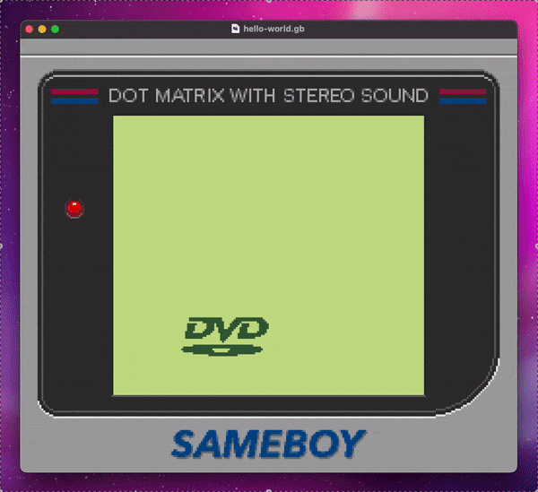

bouncing DVD logo in pure [Game Boy assembly](https://rgbds.gbdev.io/)

### Why?

Boredom

### How to run?
Download `gameboy-dvd-logo.gb` and open with a Game Boy emulator like [SameBoy](https://sameboy.github.io/) or [mGBA](https://mgba.io/)

### How to build?

`./build`

